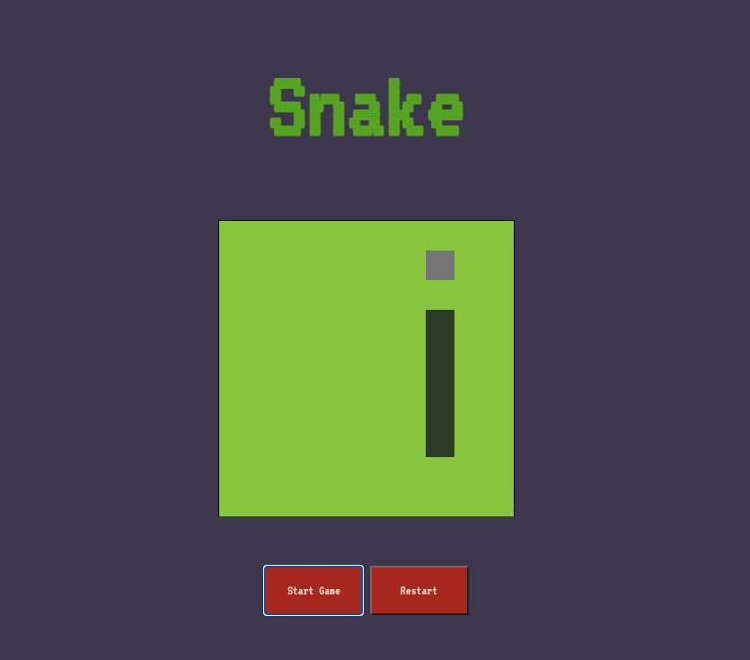

# Project-1

## Overview
The Snake game is my first project for the GA Software immersive course which was completed on week 4 of the course.
The app has been deployed on Github and you can find it [here](https://aozzy.github.io/project-1/)


## Requirements
- Render a game in the browser
- Use the following principles KISS (Keep it simple stupid) and DRY (Don't repeat yourself)
- Deploy the game on GIthub
- Include separate HTML / CSS / JavaScript files
- Use Javascript for DOM manipulation

## Snake Brief
- The snake should be able to eat food to grow bigger.
- The game should end when the snake hits the wall or itself.
- Snake speeds up as it eats more.



## Technologies used
- Javascript
- HTML
- CSS
- Git
- GitHub
- Google Fonts


# Approach
After I had completed the intial planning phase of my project I decided to use a for loop to create the grid instead of hard coding this in the HTML.
I decided to use a 10 x 10 grid, I also used flex box to correctly postion the divs into a row. 
```js
for (let index = 0; index < width ** 2; index++) {
  // ? Generate each element
  const cell = document.createElement('div')
  cell.classList.add('cell')
  grid.appendChild(cell)
  cells.push(cell)
  //  Number each cell by its index.

  cell.id = index
  

  // Set the width and height of my cells
  cell.style.width = `${100 / width}%`
  cell.style.width = `${100 / width}%`
  
}
```
## Game Functionality

- I used an Array to represent the snake, the snake's head is index 0 of the snake array and used the starting postion of 2,1,0 to represent my snake.
To define the snake direction I used an event listener for the keyup event and setup up some boundary rules using an if and else if statement so the snake would be contained within the grid.


```
document.addEventListener('keyup', (event) => {
  const key = event.key
  if (key === 'ArrowRight' && !(aSnake[0] % width === width - 1)) {  //right  side
    snakeDirection = 'ArrowRight' 
    console.log(event)
  } else if (key === 'ArrowLeft' && !(aSnake[0] % width === 0)) {    //left side
    snakeDirection = 'ArrowLeft'
    console.log(event)
  } else if (key === 'ArrowDown' && !(aSnake[0] + width >= width ** 2)) {  //bottom row
    snakeDirection = 'ArrowDown'
    console.log(event)
  } else if (key === 'ArrowUp' && !(aSnake[0] < width)) {                  //top row
    snakeDirection = 'ArrowUp'
    console.log(event)
  }

})
```

# Random food function 
The random food function works by first checking to see if the amount of food is equal to zero, if so the random postion variable will
calculate a random position on the cells, then I use a while statement to guard against the possibility of the food being on one of the same cells as the snake if so the random postion variable will recalculate another postion on the cells, the food is then added to the one of the cells on the grid.

```
function randomFood() {

  if (foodAmount === 0) {

    randomPosition = Math.floor(Math.random() * cells.length)
    console.log(randomPosition)
    while (cells[randomPosition].classList.contains('snake')) {
      randomPosition = Math.floor(Math.random() * cells.length)
    }


    cells[randomPosition].classList.add('food')
    foodAmount++
  }
}
```
# Eat food function 

The eat food function starts off with an if statement to check if the cell the snakes head is in contains food, If so the food is then
removed from that cell and the score will then increment and the amount of food decrements to zero. The interval is then cleared and a new interval created 
with an increased speed and then call the snake function. 


# Snake movement

The snake function dictates how the snake moves by defining the snake direction for every available direction the snake could travel. As the snake is stored within an array the function dictates how the array is manipulated in regards to when the snake has eaten food and when it hasn't. 


I use a setinterval within the function to get the snake moving, for every direction the snake can travel I used an if statement with a guard condition so the snake
isn't beyond the boundarys of the grid, for each direction the snake can travel I remove the class of snake from every cell on the grid, then I nest another


If statement stipulating that if the head of the snake isn't in a cell which contains food then the snake should remove the last element in the snake array 
using the pop method, the following else statement  controls the snakes growth, I call the eat food function here because the preceeding line of code doesn't get executed when the snakes head collides with the food so the last element of the array isn't removed ensuring that the snake grows. 


The unshift 
method is then used to add to the snakes head in the direction it is traveling in then the classlist of snake is then added back to the cells on the grid.

```

    
    if (snakeDirection === 'ArrowRight' && !(aSnake[0] % width === width - 1)) {

      aSnake.forEach(index => cells[index].classList.remove('snake'))
        
      if (!cells[aSnake[0]].classList.contains('food')) {
        aSnake.pop()
        
      } else {
        
        eatFood()
      }
      
      aSnake.unshift(aSnake[0] + 1)
      
      aSnake.forEach(index => cells[index].classList.add('snake'))
    
```


### Future Features

- Add local storage and implement a score board
- Have a second mode which allows players to go through walls
- Add buttons for mobile compatability

### Bugs
- The snake reappears in the last known postion after gameover when you press the start button. 


### Key Learnings

I didn't get to implement the design style that I had envisoned for the game, this was due to spending to much time on the movement of the snake
which I don't believe felt as smooth as it could've been, I've learnt the importance of planning during the development phase from the mistakes I made.
